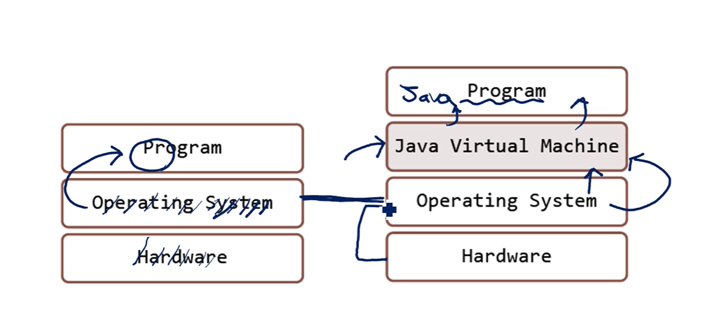
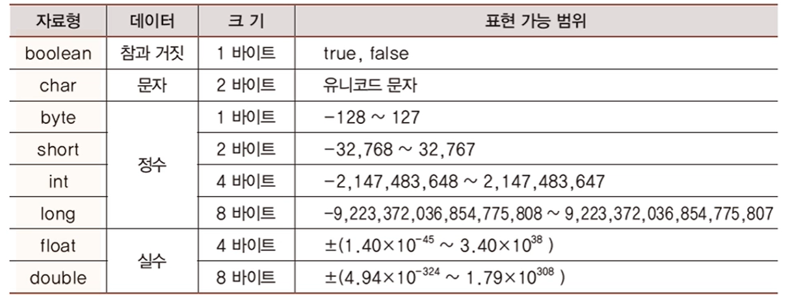
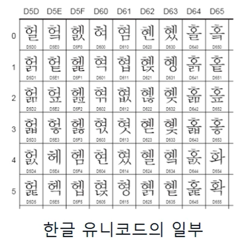
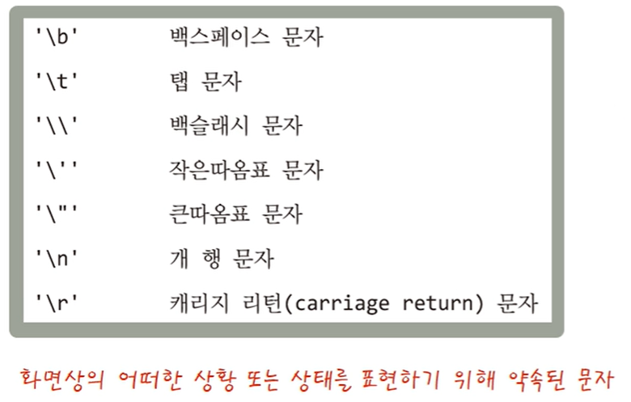
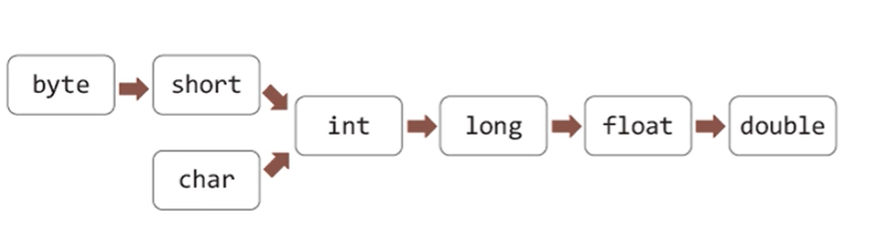

# JAVA

> Write once, Run anywhere 
>
> 자바가 깔려 있는 어느 곳에서든 실행 가능하다. - > 플랫폼 독립적이다.

## 목차

- Chapter 1 
- Chapter 2
- Chapter 3
- ...


## 설치

- JDK 12
- Intellij


## Chapter 1 기본 원리

### 자바 프로그램과 실행 원리의 이해

- 구조



- 런처와 가상머신

  - 런처 - Java.exe 

    - OS와 가상머신을 연결시킴
    - 자바 가상머신 실행 

  - 가상머신 - JVM

    - OS에 따라 달라진다. But 코드 자체를 변화시킬 필요는 없다.
    - C의 경우 운영체제에 따라 코드의 수정이 필수적이다.

    

- 자바 컴파일러와 바이트 코드

  - 자바 컴파일러

    

    - 소스파일 -> 클래스파일
    - 소스파일 내용을 가상머신이 이해할 수 있도록 변환

  - 자바 런처

    - 자바 프로그램과 자바 가상머신을 처음 구동하는 소프트웨어
    - 클래스 파일을 대상으로 구동을 시작한다.

  

### 자바 프로그램 입문

- 프로그램의 골격과 구성
  - Class  : *FirstJavaProgram*
    - method : *main*
  - **중괄호**를 이용해 클래스와 메소드의 영역을 구분
  - **세미콜론**을 통해 문장의 끝을 표시
    - 단, 명령적 성격을 가진 코드에만 표시 (class, method 정의는 표시 x)

```java
class FirstJavaProgram {
    public static void main(String[] args) {
        System.out.println("Welcome to Java");
        System.out.println("First Java Program");
    }
}
```

- 프로그램 실행 시 main 메소드 안 문장들을 순차적으로 실행
- **println**의 경우 자동 개행


- 들여쓰기와 주석
  - 블록 단위 주석 : `/**/`
  - 행 단위 주석 : `//`
  - 들여쓰기 : space 4칸


## Chapter 2 변수와 자료형

### 변수의 이해와 활용

- 변수 
  - 메모리 공간의 활용을 위한 도구
  - 메모리 공간의 할당과 접근을 위해 필요한 도구
  - 변수의 선언 -> 메모리 공간의 할당

- 변수의 선언

  - 메모리 공간의 할당
  - 변수의 용도(type), 변수의 이름

  ```java
  int num1;
  num1 = 10;
  int num2 = 20;
  int num3 = num1 + num2;
  int num4, num5;
  ```

- 자료형의 종류와 구분

  - 기본 자료형

    각 자료형 별 할당 메모리 크기가 다름

   

  - float, double의 경우 오차가 발생할 수 있음 (실수 표현 과정)

- 변수 선언 시 제약 사항 
  - 자바는 대소문자를 구분한다.
  - 변수의 이름은 숫자로 시작할 수 없다.
  - $와 _를 제외한 특수문자는 사용할 수 없다.
  - 키워드는 변수의 이름으로 사용할 수 없다.


### 정수의 표현 방식

> 정수를 표현하는 방식

*int와 long의 차이는 할당 메모리 공간의 크기 차이

- 양의 정수
  - 부호 비트(첫번째 비트)가 0이면 양의 정수, 1이면 음의 정수
  - 나머지 비트는 숫자의 크기를 표현 (2진수 형식)

- 음의 정수
  - 양의 정수의 이진 표현에 2의 보수를 취한 결과를 음의 정수로 표현
  - 즉 +5의 2의 보수가 -5를 표현하는 방식임


### 실수의 표현 방식

> 실수를 표현하는 방식
>
> 왜 오차가 발생할 수밖에 없나 (모든 언어에서 발생함)

- 실수의 범위는 무한대이기 때문에 메모리 공간에서 정의할 수 없음
  - 메모리 크기에 따라 임의로 구간을 나눠 표현함
- 입력값에 최근접 근사치를 표현함
  - 특정 수식에 대입 
  - 수식 = +-(1.m) * 2^(e-127)


### 자바의 기본 자료형

- 각 자료형은 메모리 할당 크기에 차이가 있음
  - 가장 효율적으로 코딩한다면 각 크기에 맞게끔 자료형을 사용하면 됨
    - 연산을 하지 않는 경우(저장만) 사용 가능
  - 내부적인 문제가 발생함. 때문에 int형을 보편적으로 사용

- 정수에 대한 사칙연산은 int가 디폴트임 
  - 시스템의 성능을 높이기 위해 설정된 값임
  - 가장 보편적인 크기
  - 다른 자료형을 통해 연산이 진행되면 오류가 출력될 수 있음

- 실수 자료형
  - Float : 4byte -> 소수 6번째까지 오류 x 
  - Double : 8byte -> 소수 15번째까지 오류 x
  - 자료형 선택 기준은 정밀도

- 문자 자료형 

  - 기본 char

  - 2바이트 유니코드로 표현

    - 유니코드 표

      

  - 작은 따옴표 `''`로 묶어서 하나의 문자를 표시

  - 문자의 저장은 유니코드 값의 저장으로 이어짐

  - 컴파일러가 변환시킴 

- 논리 자료형
  - 키워드 : boolean
    - true, false


##  Chapter 3 상수와 형변환

### 상수

- 상수 유형

  - 변수 -> 상수
  - int num1 =  3 + 4 (리터럴)
    - 3, 4 상수 
    - 연산 이전에 메모리 공간에 저장된 후 CPU를 통해 연산 처리가 이루어짐

- 일반적인 상수

  - 변수에 값을 딱 한번만 할당할 수 있으면 상수
  - 한 번 할당된 값은 변경이 불가함
  - 키워드 `final`이 붙어있는 변수
    - 변수명은 대문자로
    - 단어의 결함은 `_` 를 통해

  ```java
  class Constants {
  	public void static main(String[] args) {
          final int MAX_SIZE = 100;
          final char CONST_CHAR = '상';
          final int CONST_ASSIGNED;
          
          CONST_ASSIGNED = 12;
      }
  }
  ```

  

- 리터럴에 대한 이해
  - 리터럴 : 자료형을 기반으로 표현이 되는 상수
    - ex) int num1 = 5 + 7;
    - ex) double num2 = 3.3 + 4.5;
  - 정수는 무조건 int형으로 인식 / 실수는 double
    - int로 저장하기에 데이터의 크기가 너무 큰 경우 컴파일 에러가 출력됨
    -  `L` 키워드를 붙여 long형으로 저장을 요청해야 함
    - 나아가 `d`와 `f` 키워드 또한 사용 가능
  - 정수형의 경우 
    - `OB`  이진수 저장
    - `_`를 통해 구분하며 저장 가능


- 이스케이프 시퀀스

  

### 형변환

```java
//자동 형변환 예제
short n1 = 2;
short n2 = 3;
int n3 = n1 + n2;
//컴파일, 실행 가능
// 기존 변수가 상수로 저장이 될 때 int로 변환되어 저장됨
```

- 형변환이 필요한 이유

  - 두 피연산자의 자료형이 일치해야 동일한 방법을 적용하여 연산을 진행할 수 있다.
  - 피연산자의 자료형이 일치하지 않을 때 형의 변환을 통해 일치를 시켜야 한다.

- 자동 형변환

  

  - 규칙 1. 자료형의 크기가 큰 방향으로 형 변환이 일어난다.
  - 규칙 2. 자료형의 크기에 상관없이 정수 자료형보다 실수 자료형이 우선이다.
    - ex) double num1 = 30;
    - ex) System.out.println(59L + 34.5)

  - 데이터 손실이 적게 발생할 수 있는 방향으로...

- 명시적(강제) 형변환

  > 자동으로 변환되지 않는 경우, 강제적으로 변환시키고 싶을 때
  >
  > ex) long n1 = 3.14
  - (자료형)을 통해 변환 
    - ex) (int)